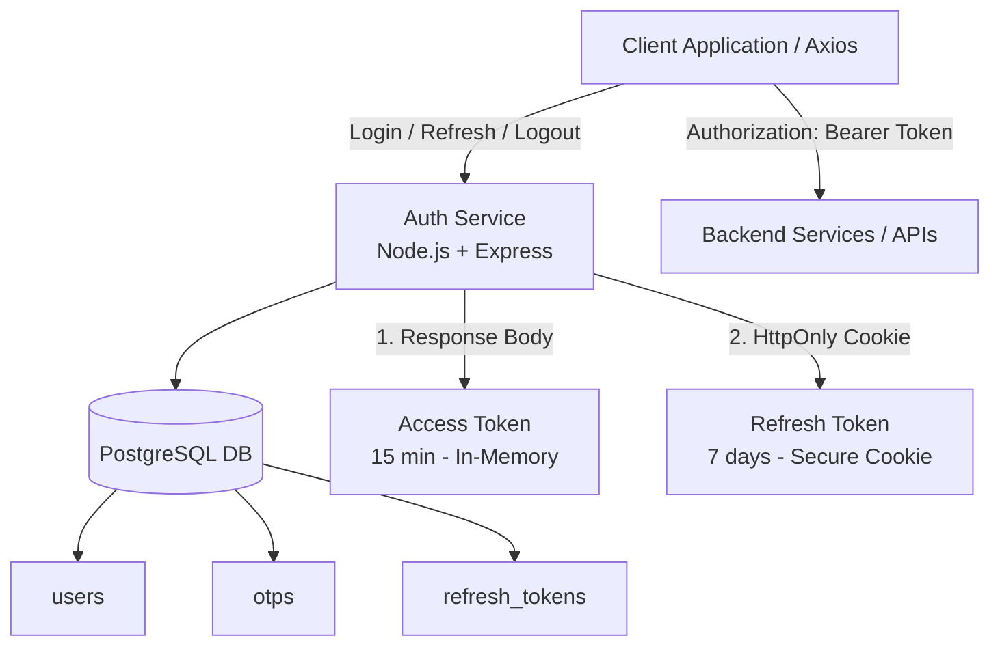

# Personal JWT Authentication Microservice

A lightweight authentication microservice built with Node.js, Express, and PostgreSQL. It features a security architecture using **short-lived Access Tokens (passed via response body & Authorization Bearer headers in application memory) and long-lived Refresh Tokens (stored in secure HttpOnly cookies and persisted in PostgreSQL)**. Email verification is implemented using 6-digit OTP codes via Brevo API (`@getbrevo/brevo`).

---

## Live Deployments

| Service | Platform | URL / Base Endpoint |
| :--- | :--- | :--- |
| **Auth Microservice** | Railway | [https://auth-service-production-4ccd.up.railway.app](https://auth-service-production-4ccd.up.railway.app) |

### Used By
- **PingX Frontend:** [https://pingx-sanjaii04.vercel.app](https://pingx-sanjaii04.vercel.app)
- **PingX Backend API:** [https://pingx-backend-production.up.railway.app](https://pingx-backend-production.up.railway.app)

---

## Authentication Architecture Diagram



---

## Features

- **Password Security:** Password hashing using `bcryptjs` (salt rounds: 10).
- **Validation:** Request body validation with `zod`.
- **Email Verification (OTP):** Sends a 6-digit verification code using Brevo Transactional Email API (`@getbrevo/brevo`) on registration.
- **In-Memory Access Tokens & HttpOnly Refresh Cookies:**
  - **Access Token:** Short-lived (15 minutes) JWT returned in the response body for in-memory client storage (sent via `Authorization: Bearer <accessToken>`).
  - **Refresh Token:** Long-lived (7 days) JWT stored in a secure `HttpOnly` cookie and persisted in PostgreSQL.
- **Automatic Silent Token Refresh:** Client interceptors request a new access token via `/auth/refresh` using the `HttpOnly` refresh token cookie without storing access tokens in localStorage.
- **Stateful Logout:** Revokes the refresh token from the database, marks the user status as `OFFLINE`, and clears the refresh cookie.

---

## Database Setup (PostgreSQL)

Run the following DDL queries to set up the database schema:

```sql
CREATE EXTENSION IF NOT EXISTS "pgcrypto";

-- Users Table
CREATE TABLE users (
    id UUID PRIMARY KEY DEFAULT gen_random_uuid(),
    username VARCHAR(50) NOT NULL,
    email VARCHAR(255) UNIQUE NOT NULL,
    password_hash TEXT NOT NULL,
    status VARCHAR(20) NOT NULL DEFAULT 'PENDING',
    created_at TIMESTAMP NOT NULL DEFAULT NOW()
);

-- OTP Codes Table
CREATE TABLE otps (
    id SERIAL PRIMARY KEY,
    user_id UUID REFERENCES users(id) ON DELETE CASCADE,
    code VARCHAR(6) NOT NULL,
    expires_at TIMESTAMP NOT NULL,
    created_at TIMESTAMP DEFAULT CURRENT_TIMESTAMP
);

-- Refresh Tokens Table
CREATE TABLE refresh_tokens (
    id SERIAL PRIMARY KEY,
    user_id UUID REFERENCES users(id) ON DELETE CASCADE,
    token TEXT UNIQUE NOT NULL,
    expires_at TIMESTAMP NOT NULL,
    created_at TIMESTAMP DEFAULT CURRENT_TIMESTAMP
);
```

---

## Environment Variables (`.env`)

Create a `.env` file in the root of the project:

```env
PORT=3000

# Database Configuration
DB_NAME=auth-service
DB_HOST=localhost
DB_PORT=5432
DB_USER=postgres
DB_PASSWORD=your_db_password

# JWT Secrets
ACCESS_TOKEN_SECRET=your_jwt_access_secret
REFRESH_TOKEN_SECRET=your_jwt_refresh_secret

# Brevo API Email Credentials
BREVO_API_KEY=your_brevo_api_key
BREVO_SENDER_EMAIL=your_verified_sender_email@example.com

# Environment
NODE_ENV=development
```

---

## API Endpoints

### 1. Register User
**POST** `/register`

**Request Body**
```json
{
  "username": "tester",
  "email": "test@example.com",
  "password": "securepassword123"
}
```

---

### 2. Verify Email (OTP)
**POST** `/verify`

**Request Body**
```json
{
  "userId": "YOUR-USER-UUID",
  "otp": "123456"
}
```

---

### 3. Resend OTP
**POST** `/resend-otp`

**Request Body**
```json
{
  "userId": "YOUR-USER-UUID"
}
```

---

### 4. Login
**POST** `/login`

**Request Body**
```json
{
  "email": "test@example.com",
  "password": "securepassword123"
}
```

**Response Body**
```json
{
  "success": true,
  "accessToken": "ey...",
  "user": {
    "id": "...",
    "username": "tester",
    "email": "test@example.com"
  }
}
```
*Note: Also sets the `refreshToken` HttpOnly cookie.*

---

### 5. Refresh Access Token
**POST** `/refresh`

*Uses the `refreshToken` HttpOnly cookie.*

**Response Body**
```json
{
  "success": true,
  "message": "Access token refreshed successfully",
  "accessToken": "ey..."
}
```

---

### 6. Logout
**POST** `/logout`

*Clears the `refreshToken` HttpOnly cookie, marks user as `OFFLINE`, and revokes the token from PostgreSQL.*

---

### 7. Get Current User (`/me`)
**GET** `/me`

*Requires `Authorization: Bearer <accessToken>` header.*

**Response Body**
```json
{
  "success": true,
  "user": {
    "userId": "...",
    "username": "tester"
  }
}
```

---

## Getting Started

```bash
# Install Dependencies
npm install

# Start Service
npm start
```

Service starts at `http://localhost:3000`.
